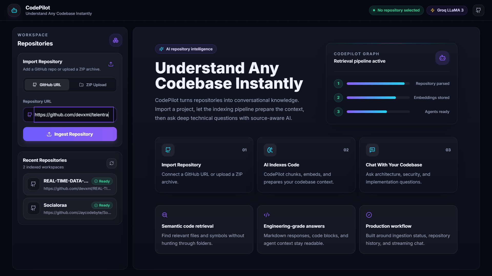
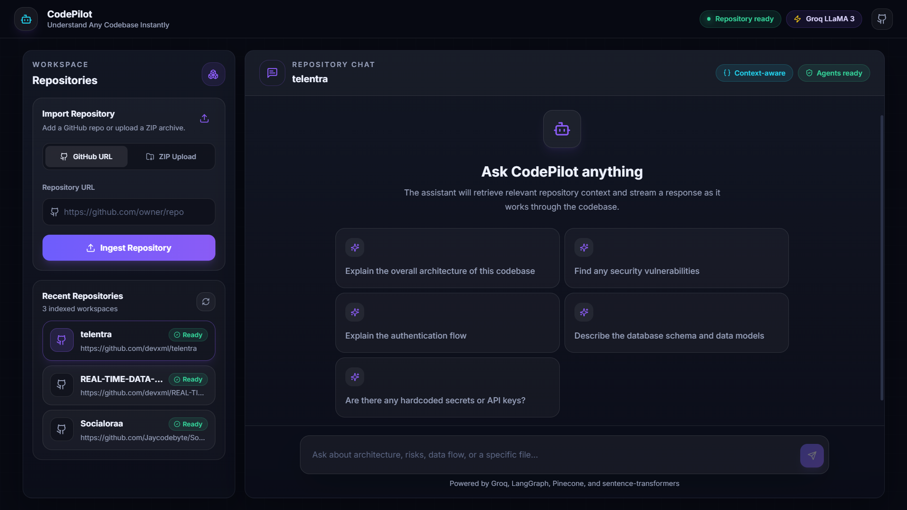
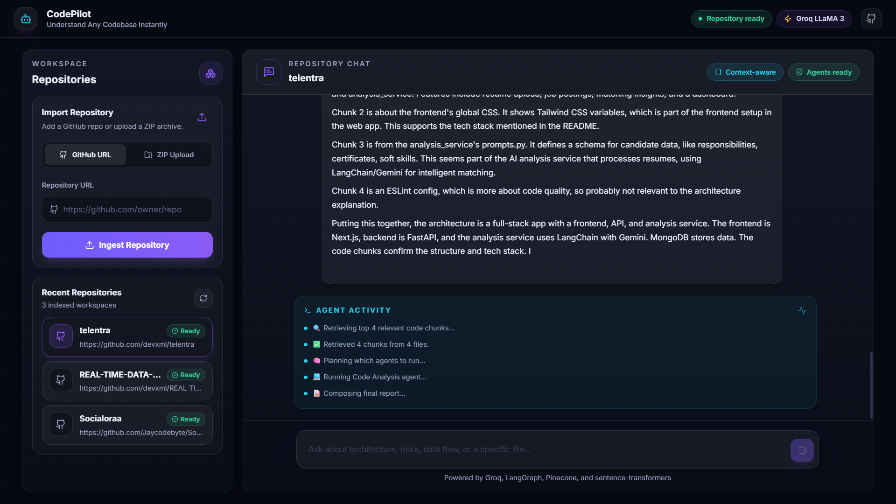

# 🤖 AI Software Engineering Copilot

An AI-powered code analysis tool. Upload a GitHub repo or ZIP file, ask questions in plain English, and get intelligent answers powered by a multi-agent LangGraph pipeline, semantic search (Pinecone), and Groq's blazing-fast LLMs — streamed live to your browser.

---

## ✨ Features

| Feature | Details |
|---|---|
| **Repo Ingestion** | GitHub clone or ZIP upload |
| **Semantic Search** | sentence-transformers + Pinecone cosine similarity |
| **Multi-Agent AI** | Planner → Retrieval → Code Analysis / Security → Report |
| **SSE Streaming** | Live word-by-word response in the UI |
| **Conversation Memory** | Last 5 exchanges injected into every prompt |
| **Docker** | One command: `docker compose up` |


---

## 📸 Screenshots

### GitHub Repository Upload



Import repositories directly using a GitHub URL or upload a ZIP file for analysis.

---

### Chat Interface



Ask questions about the codebase in plain English and receive intelligent, context-aware answers powered by semantic search and AI agents.

---

### Real-Time SSE Streaming



Responses are streamed live to the browser using Server-Sent Events (SSE), providing a smooth and interactive chat experience.

---

## 📁 Project Structure

```
ai-copilot/
├── backend/
│   ├── app/
│   │   ├── agents/
│   │   │   ├── state.py          ← Shared LangGraph state TypedDict
│   │   │   ├── graph.py          ← Compiled LangGraph graph
│   │   │   ├── planner.py        ← Decides which agents to run
│   │   │   ├── retrieval.py      ← Embeds query + fetches Pinecone chunks
│   │   │   ├── code_analysis.py  ← Explains code / architecture
│   │   │   ├── security.py       ← Finds vulnerabilities
│   │   │   └── report.py         ← Composes final markdown answer
│   │   ├── api/
│   │   │   ├── upload.py         ← ZIP / GitHub ingestion endpoints
│   │   │   └── chat.py           ← SSE streaming chat endpoint
│   │   ├── core/
│   │   │   └── config.py         ← Pydantic settings from .env
│   │   ├── db/
│   │   │   ├── models.py         ← SQLAlchemy ORM models
│   │   │   └── session.py        ← Async engine + session factory
│   │   ├── services/
│   │   │   ├── file_walker.py    ← Walks repo, returns source files
│   │   │   ├── chunker.py        ← Token-based overlapping chunker
│   │   │   ├── embedder.py       ← sentence-transformers local embeddings
│   │   │   ├── vector_store.py   ← Pinecone upsert + search
│   │   │   └── ingestion.py      ← Full pipeline orchestrator
│   │   └── main.py               ← FastAPI app factory
│   ├── requirements.txt
│   ├── .env.example
│   └── Dockerfile
│
├── frontend/
│   ├── src/
│   │   ├── app/
│   │   │   ├── page.tsx          ← Main two-column layout
│   │   │   ├── layout.tsx        ← Root HTML layout
│   │   │   └── globals.css       ← Tailwind + custom styles
│   │   ├── components/
│   │   │   ├── UploadPanel.tsx   ← Drag-and-drop + GitHub URL
│   │   │   ├── ProjectSelector.tsx ← Switch between projects
│   │   │   ├── ChatInterface.tsx ← Full chat with SSE streaming
│   │   │   ├── ChatMessage.tsx   ← Message bubble + markdown
│   │   │   └── StatusBar.tsx     ← Live agent progress display
│   │   └── lib/
│   │       └── api.ts            ← Typed API client + streamChat()
│   ├── package.json
│   ├── tailwind.config.js
│   ├── next.config.mjs
│   └── Dockerfile
│
├── docker-compose.yml
├── .gitignore
└── README.md
```

---

## 🚀 Getting Started

### 1. Clone and configure

```bash
git clone <this-repo>
cd ai-copilot

# Configure backend secrets
cp backend/.env.example backend/.env
# Edit backend/.env and fill in:
#   PINECONE_API_KEY
#   GROQ_API_KEY
```

### 2. Run with Docker (recommended)

```bash
docker compose up --build
```

- Frontend: http://localhost:3000
- Backend API: http://localhost:8000
- API docs: http://localhost:8000/docs

### 3. Run locally (dev)

**Backend:**
```bash
cd backend
python -m venv venv && source venv/bin/activate
pip install -r requirements.txt
cp .env.example .env   # fill in keys
uvicorn app.main:app --reload
```

**Frontend:**
```bash
cd frontend
npm install
cp .env.local.example .env.local
npm run dev
```

---

## 🔑 Required API Keys

| Service  | Get Key |
|---|---|
| **Pinecone** | https://app.pinecone.io |
| **Groq**  | https://console.groq.com |

---

## 🏗️ Architecture

```
User
 │
 ▼
Next.js Frontend (port 3000)
 │  ← SSE stream
 ▼
FastAPI Backend (port 8000)
 │
 ├── /api/upload/zip        → Ingestion Pipeline
 ├── /api/upload/github     →   file_walker → chunker → embedder → Pinecone
 └── /api/chat/stream       → LangGraph Graph
                                 │
                          ┌──────▼──────┐
                          │  retrieval  │ ← embed query → Pinecone top-10
                          └──────┬──────┘
                          ┌──────▼──────┐
                          │   planner   │ ← decides: code_analysis | security
                          └──────┬──────┘
                     ┌───────────┴────────────┐
               ┌─────▼──────┐         ┌───────▼──────┐
               │code_analysis│         │   security   │
               └─────┬───────┘         └───────┬──────┘
                     └───────────┬─────────────┘
                          ┌──────▼──────┐
                          │   report    │ ← compose final markdown
                          └─────────────┘
                                 │
                          PostgreSQL ← save conversation
```

---

## 📖 Usage

1. **Import a repo** — paste a GitHub URL or drag a ZIP
2. **Wait for ingestion** — typically 30s–2min depending on repo size
3. **Ask questions** — the AI retrieves relevant chunks and analyzes them

### Example queries
- `"Explain the overall architecture"`
- `"Find SQL injection vulnerabilities"`
- `"Describe the authentication flow"`
- `"Are there any hardcoded API keys?"`
- `"What does the UserService class do?"`

---

## 🛠️ Tech Stack

| Layer | Technology |
|---|---|
| Frontend | Next.js 14, React, Tailwind CSS, react-markdown |
| Backend | FastAPI, Python 3.11, SQLAlchemy (async) |
| Database | PostgreSQL 15 |
| Embeddings | sentence-transformers `all-MiniLM-L6-v2` (local, 384-dim) |
| Vector DB | Pinecone |
| LLM | Groq (llama3-70b-8192) |
| Agents | LangGraph |
| Streaming | Server-Sent Events (SSE) |
| Container | Docker + docker-compose |
