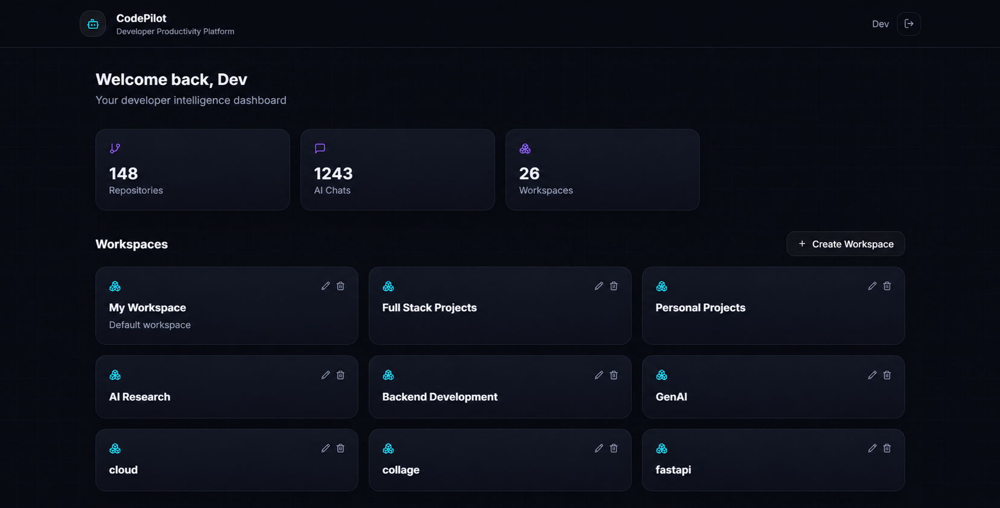
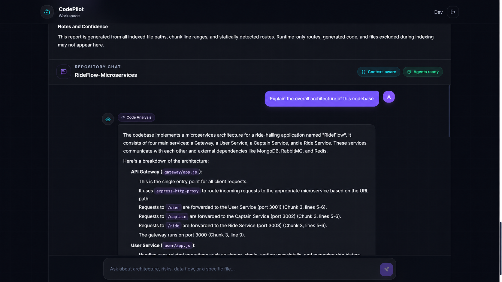
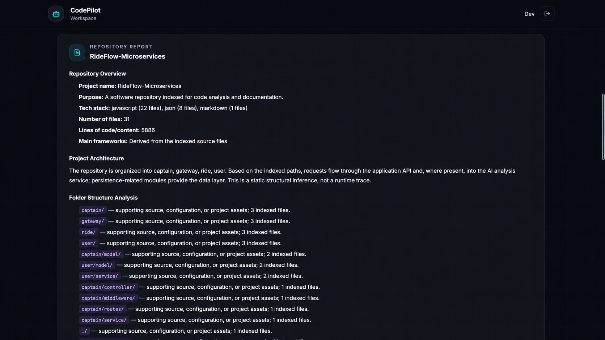
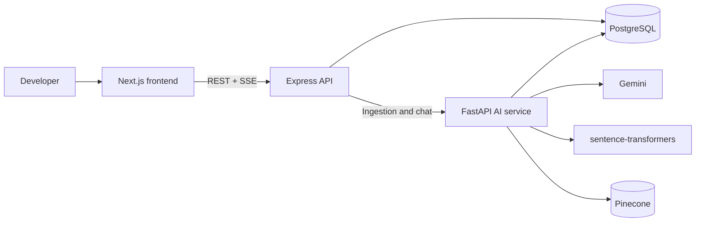
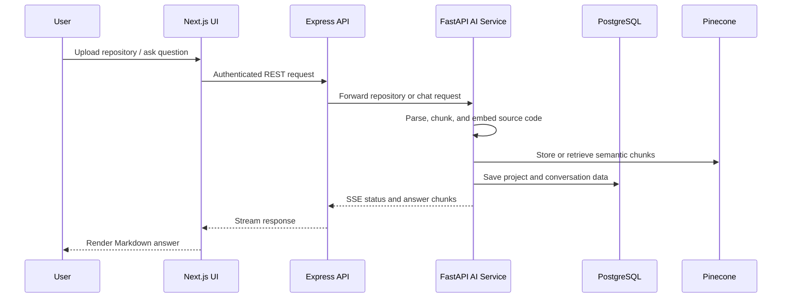

# CodePilot

> An AI-powered developer productivity platform for understanding unfamiliar codebases faster.

CodePilot turns a GitHub repository or ZIP archive into a searchable, conversational workspace. Upload a project, let CodePilot index its code, then ask focused questions about architecture, data flow, data models, APIs, and security risks.

## Overview

CodePilot combines a polished Next.js application, an Express product API, and a FastAPI AI service. The AI layer retrieves relevant source-code chunks, orchestrates specialized analysis, and streams Markdown responses back to the browser.

## Features

- Upload ZIP archives or import public GitHub repositories
- Create workspaces and keep repositories and chat sessions organized
- Index source files, functions, classes, languages, and API routes
- Ask repository-aware questions in a streaming chat interface
- Retrieve semantic code context with Pinecone and sentence-transformers
- Generate architecture, implementation, and security analysis
- Persist repository metadata, conversations, and user data in PostgreSQL
- Run the complete stack locally with Docker Compose

## Screenshots


### Dashboard 
 

### Repository chat 
 

### Repository report
 


## Tech Stack

| Layer | Technologies |
| --- | --- |
| Frontend | Next.js 14, React, TypeScript, Tailwind CSS |
| Product API | Node.js, Express, Prisma, JWT, Multer |
| AI service | Python, FastAPI, LangGraph, Google Gemini |
| Retrieval | Pinecone, sentence-transformers |
| Data | PostgreSQL, SQLAlchemy, Prisma |
| Delivery | Docker Compose |

## Architecture



### Repository ingestion and chat flow



## Installation

### Prerequisites

- Docker Desktop and Docker Compose, or Node.js 20+ and Python 3.12+
- A PostgreSQL database
- A Gemini API key
- A Pinecone API key and index

### Run with Docker (recommended)

1. Clone the repository and create a root `.env` file:

   ```env
   GEMINI_API_KEY=your_gemini_key
   GEMINI_MODEL=gemini-2.5-flash-lite
   PINECONE_API_KEY=your_pinecone_key
   PINECONE_INDEX_NAME=codepilot
   JWT_SECRET=replace-with-a-long-random-string
   ```

2. Start the stack:

   ```bash
   docker compose up --build
   ```

3. Open `http://localhost:3000`.

Services are available at:

- Frontend: `http://localhost:3000`
- Product API: `http://localhost:4000`
- AI API and OpenAPI docs: `http://localhost:8000/docs`

### Run locally

Start PostgreSQL first, then run each service in a separate terminal.

```bash
# Product API
cd server
npm install
npm run db:generate
npm run db:push
npm run db:seed
npm run dev
```

```bash
# AI service
cd backend
python -m venv .venv
# Windows: .\.venv\Scripts\Activate.ps1
# macOS/Linux: source .venv/bin/activate
pip install -r requirements.txt
python -m uvicorn app.main:app --reload --port 8000
```

```bash
# Frontend
cd frontend
npm install
npm run dev
```

Configure environment variables before starting services. Never commit API keys, database passwords, or JWT secrets.

## Usage

1. Register or sign in.
2. Create a workspace.
3. Upload a ZIP archive or import a GitHub URL.
4. Wait for indexing to complete.
5. Open the repository chat and ask questions such as:

   - `Explain the overall architecture of this codebase`
   - `Describe the database schema and data models`
   - `Trace the authentication flow`
   - `Find potential security vulnerabilities`

## API

The Express API is served at `/api`; protected endpoints require a Bearer token.

| Area | Example endpoint | Purpose |
| --- | --- | --- |
| Authentication | `POST /api/auth/login` | Authenticate a user and receive a JWT |
| Workspaces | `GET /api/workspaces` | List the current user's workspaces |
| Repositories | `POST /api/workspaces/:workspaceId/repositories/upload/zip` | Upload a repository archive |
| Repositories | `POST /api/workspaces/:workspaceId/repositories/upload/github` | Import a GitHub repository |
| Chat | `POST /api/workspaces/:workspaceId/repositories/:repositoryId/chats/:sessionId/stream` | Stream a repository-aware answer over SSE |
| AI docs | `GET http://localhost:8000/docs` | Explore FastAPI endpoints interactively |

Example chat request:

```bash
curl -N -X POST \
  "http://localhost:4000/api/workspaces/<workspaceId>/repositories/<repositoryId>/chats/<sessionId>/stream" \
  -H "Authorization: Bearer <token>" \
  -H "Content-Type: application/json" \
  -d '{"question":"Explain the authentication flow"}'
```

## Project Structure

```text
codepilot/
├── assets/                 # README screenshots and visual assets
├── backend/                # FastAPI AI service
│   └── app/
│       ├── agents/         # Retrieval, planning, analysis, reporting
│       ├── api/            # Upload, report, and chat endpoints
│       ├── db/             # SQLAlchemy models and sessions
│       └── services/       # Ingestion, embeddings, vector search, LLM
├── frontend/               # Next.js user interface
│   └── src/
│       ├── app/            # Pages and layouts
│       ├── components/     # Chat, upload, and project UI
│       └── lib/            # API client
├── server/                 # Express product API
│   ├── prisma/             # Prisma schema and migrations
│   └── src/                # Routes, middleware, and services
├── docker-compose.yml
└── README.md
```

## Development Notes

- Run `npm run build` from `frontend/` and `server/` before opening a pull request.
- Use the FastAPI docs at `/docs` to inspect AI-service endpoints during development.
- The project is designed for local development and portfolio demonstration; production deployments should add managed secrets, background jobs, rate limiting, observability, and hardened authorization policies.

